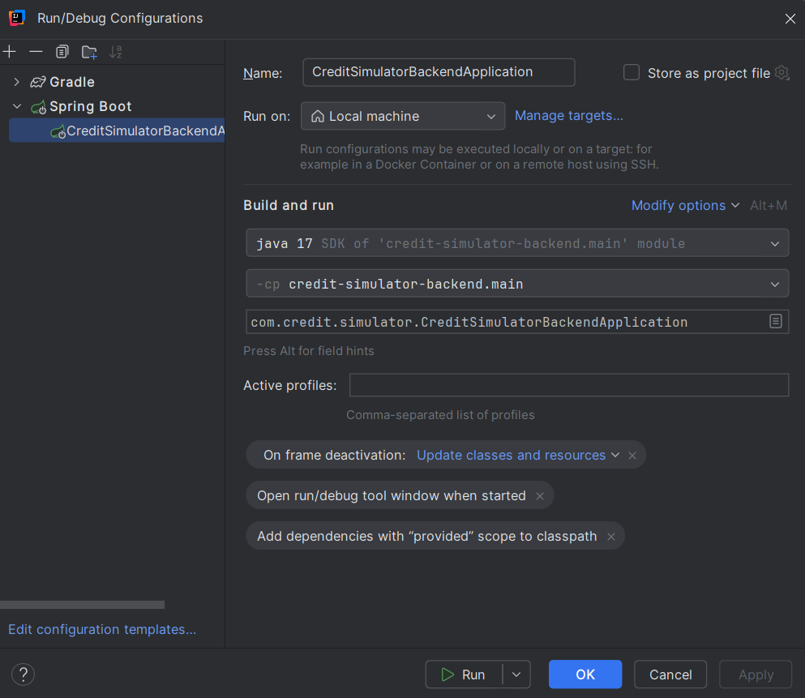

# Simulador de Crédito (Backend)

## 📋 Sobre o Projeto
Sistema backend para simulação de crédito desenvolvido com Spring Boot. A aplicação fornece uma API REST para realizar simulações e análises de crédito.

## 🛠️ Tecnologias Utilizadas
- Java 17
- Spring Boot
- Jakarta EE
- Spring Data JPA
- Spring MVC
- Kotlin 2.1

## ⚙️ Configurações do Projeto
- Nome da Aplicação: credit-simulator-backend
- Porta: 8081

## 🔧 Configuração do Ambiente de Desenvolvimento
1. Importe o projeto em sua IDE preferida (recomendamos IntelliJ IDEA)
2. Certifique-se de que o JDK 17 está configurado corretamente
3. Atualize as dependências do Maven

## 🚀 Como Executar
NO CAMPO EDIT CONFIGURATION SELECIONE CreditSimulatorApplication e clique em RUN

### Pré-requisitos
- JDK 17 ou superior
- Maven

### Passos para Execução
1. Clone o repositório:

A aplicação estará disponível em: `https://github.com/alozano33/credit-simulator-backend`

##TESTES
SIMULAÇÃO DE CRÉDITO VIA POST 

curl --location 'http://localhost:8081/api/v1/simulacao-credito/simulacao' \
--header 'Content-Type: application/json' \
--data '{
"valorEmprestimo": 20000,
"dataNascimento": "1939-12-16",
"quantidadeParcelas": 12

}'

SIMULAÇÃO DE TAXA DE JUROS ATRAVÉS DA DATA DE NASCIMENTO VIA GET

curl --location 'http://localhost:8081/api/v1/simulacao-credito/avaliacao?dataNascimento=1939-12-16'

ENDPOINTS

[http://localhost:8081/api/v1/simulacao-credito/simulacao
http://localhost:8081/api/v1/simulacao-credito/avaliacao?dataNascimento=1939-12-16
]

